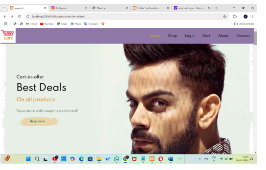
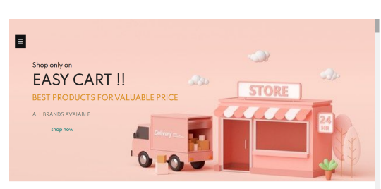
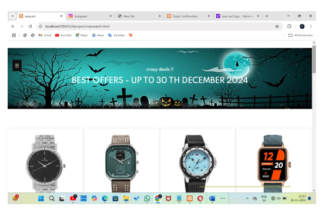
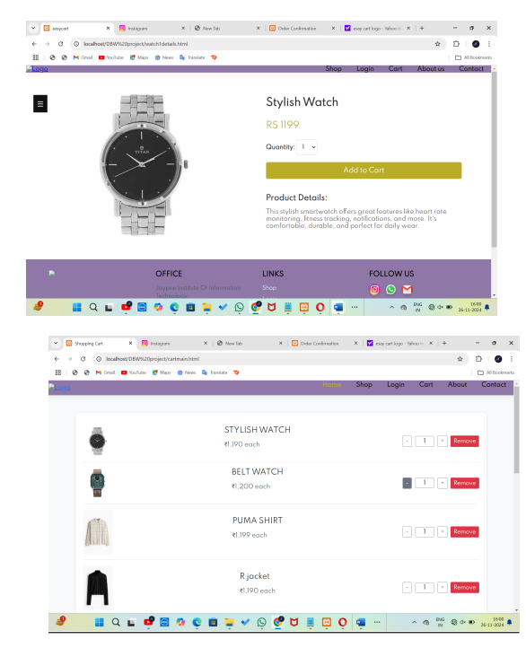
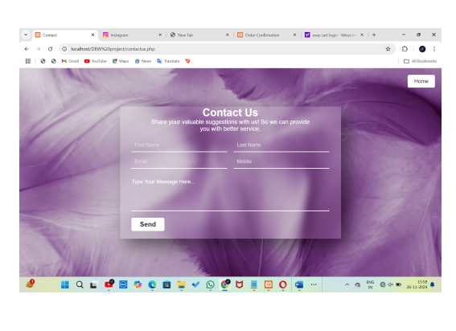
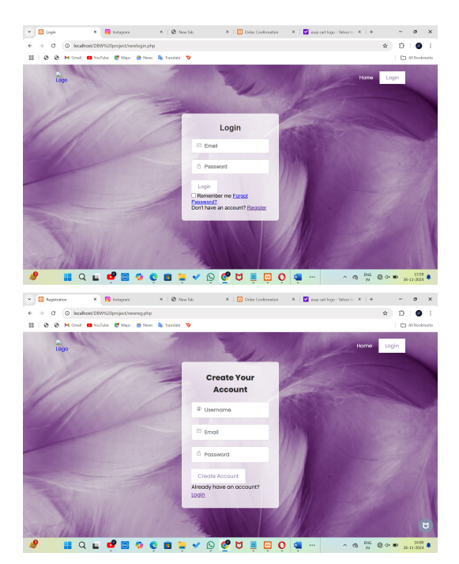

# 🛒 EasyCart – Full-Stack E-commerce Website

A dynamic online shopping platform built using **HTML, CSS, JavaScript, PHP, and MySQL**, offering seamless user experience and complete cart-to-checkout functionality.

---

## 🔍 Description

**EasyCart** is a full-featured e-commerce web application designed to simplify online shopping for users while supporting small-to-medium sellers. It includes real-time product search, cart management, order tracking, and admin-side operations.

---

## 🚀 Features

- 🔐 User Authentication (Registration/Login)
- 🛍️ Product Listing with Filters & Categories
- 🛒 Cart and Checkout with Order Confirmation
- 📦 Dynamic Order Summary & Email Notification
- 📊 Admin Product Management (PHP-MySQL)
- 📧 Contact Us Page with Backend Form Handling
- 📱 Fully Responsive UI

---

## 🧰 Tech Stack

- **Frontend:** HTML, CSS, JavaScript  
- **Backend:** PHP  
- **Database:** MySQL  
- **Server:** Apache (XAMPP / LAMP)  
- **Form Validation:** HTML5 + PHP + JS

---

## 📸 Screenshots

### 🏠 Home Page  

### 🛍️ Product Listings  

### 🛒 Cart Page  

### 📧 Contact Us  

### 🔐 Login Page  

---

## 🎯 Objectives

- Provide a **centralized e-commerce solution** for all product categories.
- Enable **easy onboarding for small businesses and sellers**.
- Improve **user navigation**, search experience, and checkout process.
- Ensure **secure form handling** and smooth **database integration**.
- Enhance customer satisfaction with **real-time order tracking** and **support**.

---

